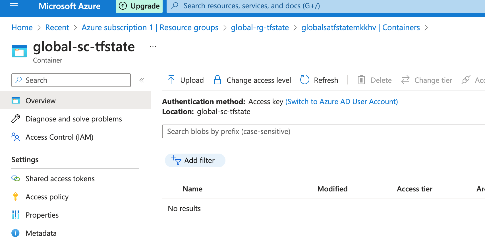
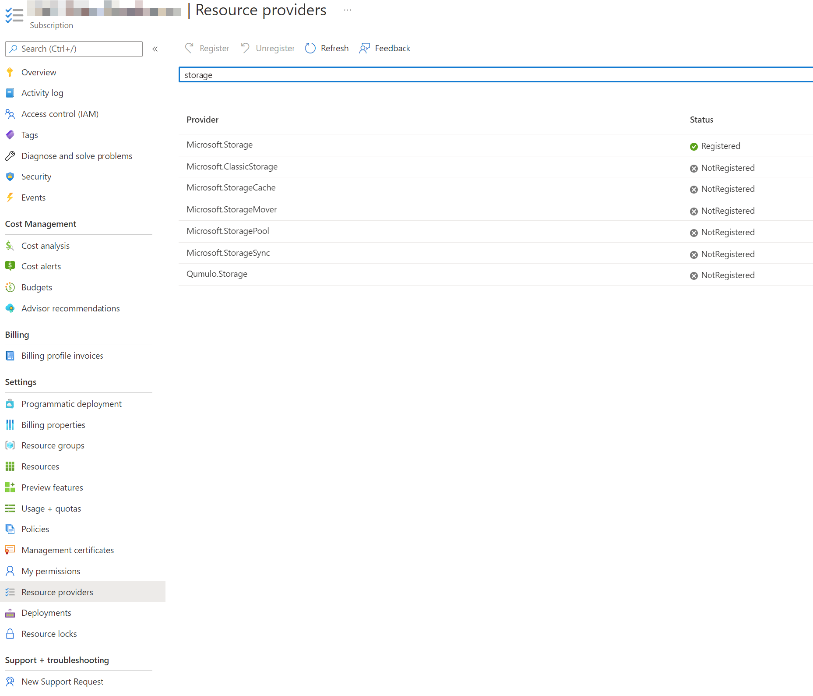

Remote Backend State with Terraform and Azure Storage
===========

The Terraform state maps real-world resources to the configuration, it tracks metadata, such as dependencies between resources, and improves performance for large infrastructure by caching information on resources in the state.

How do we address potential issues when working in a team to deploy infrastructure as code? We use a centralized state file that everyone has access to. These remote states can be accessed and shared by multiple people.

We will use Azure Blob Storage.  There are two steps to follow.  First, we need to create a storage account.  Second, we configure the main.tf to use the remote state location.

Software versions
----------------------

- `terraform` - Terraform v1.3.6
- `azure-cli` - azure-cli: 2.50.0

Resources to create
----------------------
Create an Azure Resource Group to organize the Storage Account within.

This will generally be a resource group just for this Azure Storage Account since it will be secure and managed separately from any other resources.

Create the Azure Storage Account to use.

Create the Container where the state file will be stored.

In this example, the container was named `global-sc-tfstate`


Makefile to deploy terraform
----------------------

```bash
make tf-init env=demo
make tf-plan env=demo
make tf-apply env=demo

## view outputs
make tf-output env=demo

## destroy resources
make tf-destroy env=demo
```

Screenshots
----------------------


Troubleshooting
----------------------

- Register Providers
In this case you need to register manually in the portal o using azure-cli. Due this parameter in the provider:

```bash
skip_provider_registration = true
```

```bash
Cannnot register providers: Microsoft.Storage
```


Configure terraform backend state
----------------------

To configure the backend state in your new project, you need the following Azure storage information:

```bash
storage_account_name: The name of the Azure Storage account.
container_name: The name of the blob container.
key: The name of the state store file to be created.
access_key: The storage access key
```

Do not use Default Configuration
```hcl
# Don't do this
terraform {
  backend "azurerm" {
    resource_group_name  = "StorageAccount-ResourceGroup"
    storage_account_name = "abcd1234"
    container_name       = "tfstate"
    key                  = "prod.terraform.tfstate"

    # Definitely don't do this!
    access_key           = "…"
  }
}
```

Use Partial Configuration
```
# This is better
terraform {
  backend "azurerm" {
  }
}
```

Create and Ignore the Backend Configuration File
Instead of using Azure Storage Account Access Keys, I use short-lived Shared Access Signature (SAS) Tokens. So I create a local azure.conf file that looks like this:

```bash
# azure.conf, must be in .gitignore
storage_account_name="azurestorageaccountname"
container_name="storagecontainername"
key="project.tfstate"
access_key=""
```

Or you can use a env variable
```bash
ACCOUNT_KEY=$(az storage account keys list --resource-group $RESOURCE_GROUP_NAME --account-name $STORAGE_ACCOUNT_NAME --query '[0].value' -o tsv)
export ARM_ACCESS_KEY=$ACCOUNT_KEY
```

Documentation
----------------------
- [Registering Terraform Providers](https://blog.simontimms.com/2022/08/12/register_providers/#:~:text=For%202%20it%20requires%20logging,select%20it%20and%20hit%20Register%20)
- [Store Terraform state in Azure Storage](https://learn.microsoft.com/en-us/azure/developer/terraform/store-state-in-azure-storage?tabs=azure-cli)

Authors
=======

<franco.navarrotel@gmail.com>